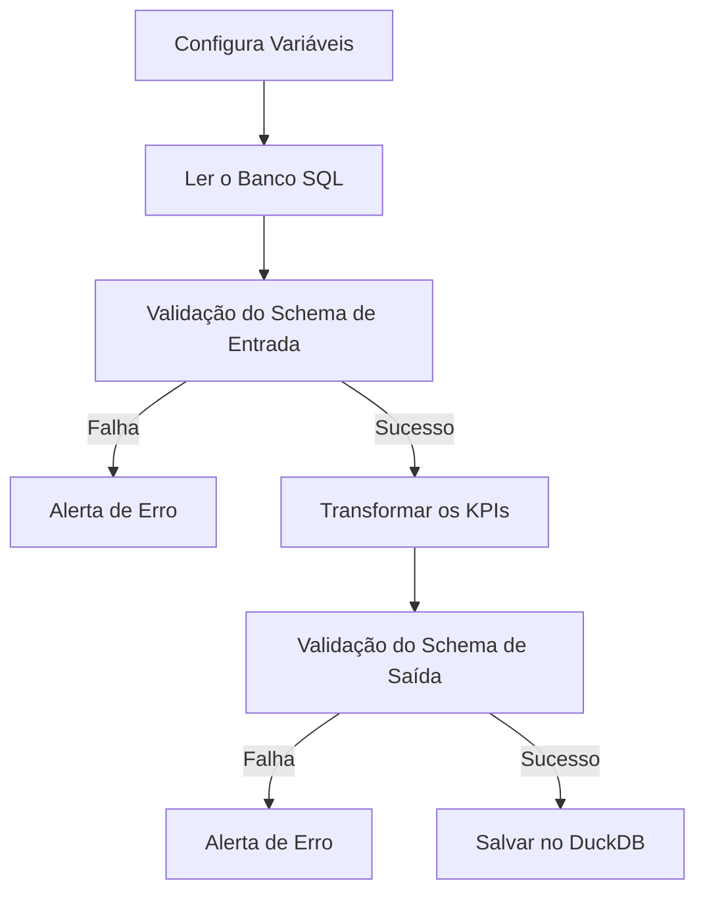

# Documentação - Data Quality

Para desenvolver o modelo, vamos montar a seguinte ETL

## Contrato de dados

::: app.schema.ProdutoSchema

## Transformação

::: app.etl.extrair_do_sql

::: app.etl.load_settings

::: app.etl.transformar

::: app.etl.load_to_duckdb